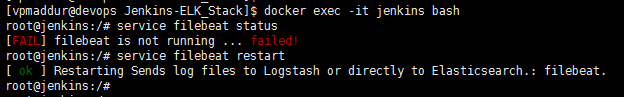
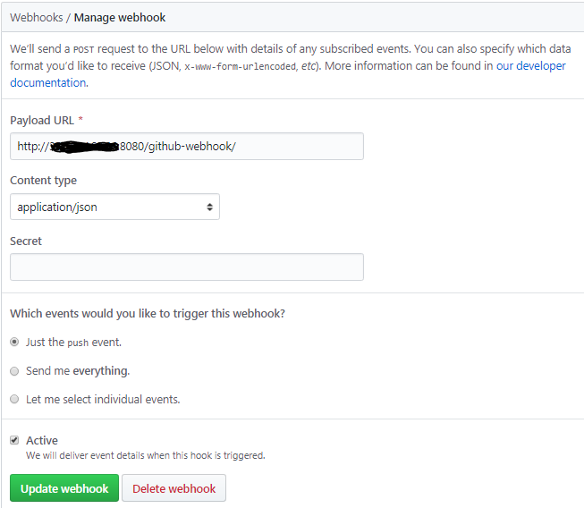
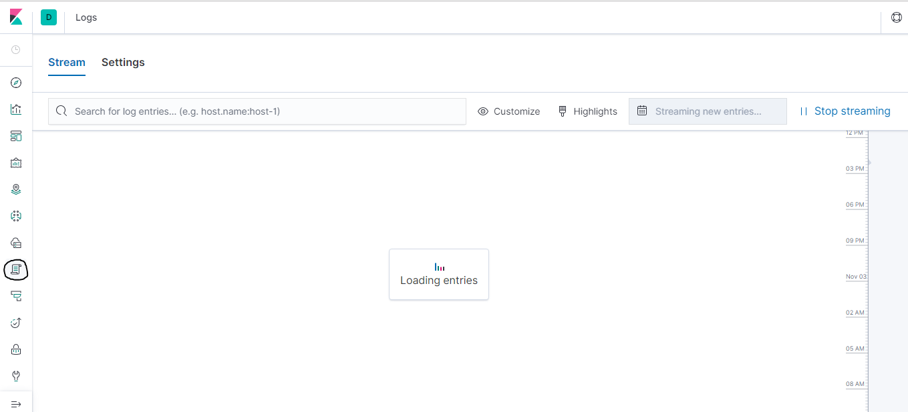
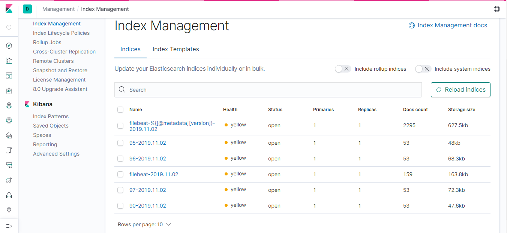

# Setup Instructions

## Requirements

Docker, docker-compose

Please open necessary ports to allow communication between different components of container (Jenkins: 8080, 50000 & Kibana: 5601 & Logstash: 5044 & ElastiSearch: 9200, 9300)

## Steps

Clone repo https://github.com/PavanKumarMadduri/Jenkins-ELK_Stack.git

Make sure the cloned folder has enough permissions to access the files required to install containers

Use the command "docker-compose up -d" to create 4 container (Jenkins, Logstash, ElasticSearch, Kibana)

### Jenkins

Login into Jenkins container using the command "docker exec -it jenkins bash"

Start the filebeat service using "service filebeat status"

Open Jenkins GUI using URL http://<IP>:8080

Create a Pipeling Project and Enter your Github project details for which you want to run CI/CD

### Github

Goto Github repo >Settings>Webhooks>Add Webhook. Please use below image for reference

### Logstash

Use logstash.conf in logstash folder to create filters and change the output

### Kibana

Access Kibana GUI using URL "http://<IP>:5601" and Goto logs sections to check if you are receiving build logs. (Snapshot attached below)

You should see Index getting created as per the configuration given in logstash.conf output section. In Kibana navigate through Management > Elasticsearch > Index Management to see the same.

